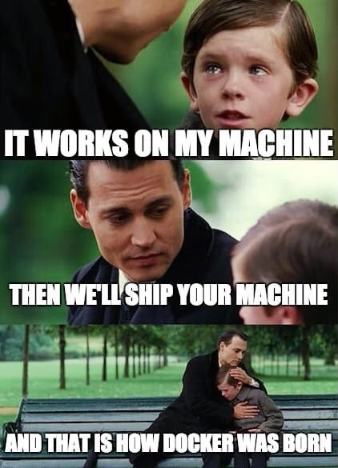
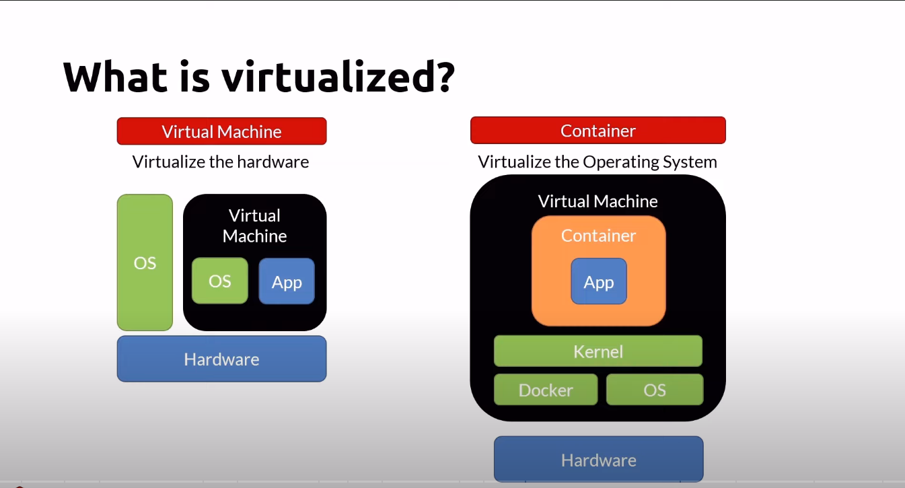

# Docker

## Por que container?

- Deploy rápidos em menores unidades.

- Uso menor de recursos.

- Maior capacidade em um mesmo host.

- Automatizações mais rápidas.

- Portabilidade.

- Isolado

- 

## O que é virtualização



- Inicio imediato

- Leves

- Ideal para terafas curtas

---

# What is Docker

- Um open source container runtime.

- Suporte para Mac, Windows & Linux.

- Command line tool (**CLI**).

- Arquivo para construri os containers "Dockerfile".

- Windows deixa rodar containers Windows and Linux.

## Registro de Containers

- Repositorio centralizado de containers

- GitHub para Containers

- Docker Hub
  
  - https://hub.docker.com/

- Cloud Providers tambem tem seus próprios Registros de Containers

## Orquestradores

- Gerenciar
  
  - Infrastructure
  
  - Containers
  
  - Deployment
  
  - Scaling
  
  - Failover
  
  - Health monitoring
  
  - App Upgrades, Zero-Downtime deployments

- Escolha entre a grande variedades
  
  - Kubernets, Swarm, Service Fabric

# 

## How to install

É Necessario instalar o dockers engine atraves do link:

[Install Docker Engine | Docker Documentation](https://docs.docker.com/engine/install/)

**Obs: No Windows é preferivel usar o WSL (Windows subsystem for Linux).**

## CLI Commands

| docker cli                       |                                     |
| -------------------------------- |:----------------------------------- |
| docker version                   | Display the system's version        |
| docker login                     | Log in to a Docker registry         |
| docker info                      | Display system information          |
| docker pull [imageName]          | Pull an image from a registry       |
| docker run [imageName]           | Run containers                      |
| docker run -d [imageName]        | Detached mode                       |
| docker start [containerName]     | Start stopped containers            |
| docker ps                        | List runnig containers              |
| docker ps -a                     | List running and stopped containers |
| docker stop [containerName]      | Stop containers                     |
| docker kill [containerName]      | Kill containers                     |
| docker image inspect [imageName] | Get image info                      |

### Docker Bash example

```bash
#pull and run an nginx server
docker run --publish 80:80 --name webserver nginx

#list the running containers
docker ps

#stop the container
docker stop webserver

#remove the container
docker rm webserver
```

### Docker CLI Cheat Sheet - Attach Shell

| Docker attach shell                               |                              |
| ------------------------------------------------- | ---------------------------- |
| docker run -it -- /bin/bash                       | Attach shell                 |
| docker run -it -- microsoft/powershell:nanoserver | Attach Powershell            |
| docker container exec -it [containerName] -- bash | Attach to a running containe |

### Docker CLI Cheat Sheet - Cleaning up

| docker                       |                                               |
| ---------------------------- | --------------------------------------------- |
| docker rm [containerName]    | Removes stopped containers                    |
| docker rm $(docker ps -a -q) | Removes all stopped containers                |
| docker images                | Lists images                                  |
| docker rmi [imageName]       | Deletes image                                 |
| docker system prune -a       | Remove all images not in use by any container |

### Docker CLI Cheat Sheet - Cleaning up

| docker                            |                                                                 |
| --------------------------------- | --------------------------------------------------------------- |
| docker build -t [name:tag] .      | Builds an image using Dockerfile located in the same folder     |
| docker build -t [name:tag] -f     | Build an image using a Dockerfile located in a different folder |
| docker tag [imageName] [name:tag] | Tag an existing image                                           |

### Dockerfile - nginx

```dockerfile
FROM nginx:alpine
COPY . /usr/share/nginx/html
```

### Dockerfile - Node site

```dockerfile
FROM alpine
RUN apk add -update nodejs nodejs-npm
COPY . /src
WORKDIR /src
RUN npm install
EXPOSE 8080
ENTRYPOINT ["node", "./app.js"]
```

## Docker CLI - Tagging

docker tag => Create a target image

- name:tag
  
  - myimage:v1

- repository/name:tag
  
  - myacr.azurecr.io/myimage:v1

### Video Original no canal do YouTube freeCodeCamp.org em inglês

### [Docker Containers and Kubernetes Fundamentals – Full Hands-On Course - YouTube](https://www.youtube.com/watch?v=kTp5xUtcalw)

# Mãos à massa!

```bash
git clone https://github.com/juliano-pinheiro-martinello/docker

cd /docker

docker build -t image-test .
```